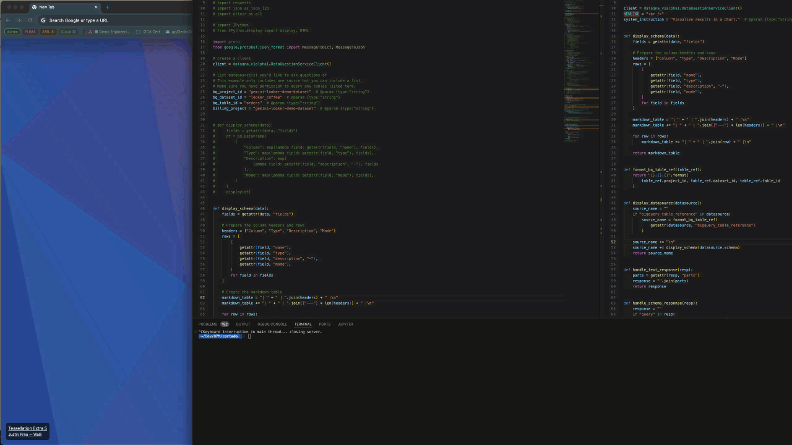

# Gradio

# Overview

This app helps to run gradio locally to test Cortado.

## Requirements

Pip install

- [gradio](https://pypi.org/project/gradio/)
- [altair](https://pypi.org/project/altair/)
- [DataQNA (this is the SDK to use Cortado)](tbd)

Ensure your are [authenticated](https://cloud.google.com/docs/authentication/provide-credentials-adc#local-dev) via [gcloud](https://cloud.google.com/sdk/docs/install)

## Setup

Run the python file either via terminal or directly using an IDE of choice.

### Inputs

The interface currently takes four inputs

- Billing project: the billing project ID of the project that has the API enabled
- Project ID: the project that holds the dataset you are using with Cortado
- Dataset ID: the dataset to be referenced by Cortado
- Table ID: the table to be referenced by Cortado

Info: the latter three are used to construct the datasource reference

### Outputs

Output1:

- Question
- Datasource
- Schema
- SQL Query used
- Data returned
- Text Answer

Output 2:

- Chart, if applicable for the question

### Disclaimer

At the time of creation, the API only supported BQ datasources- Looker datasources to follow and will be added subsequentially.
